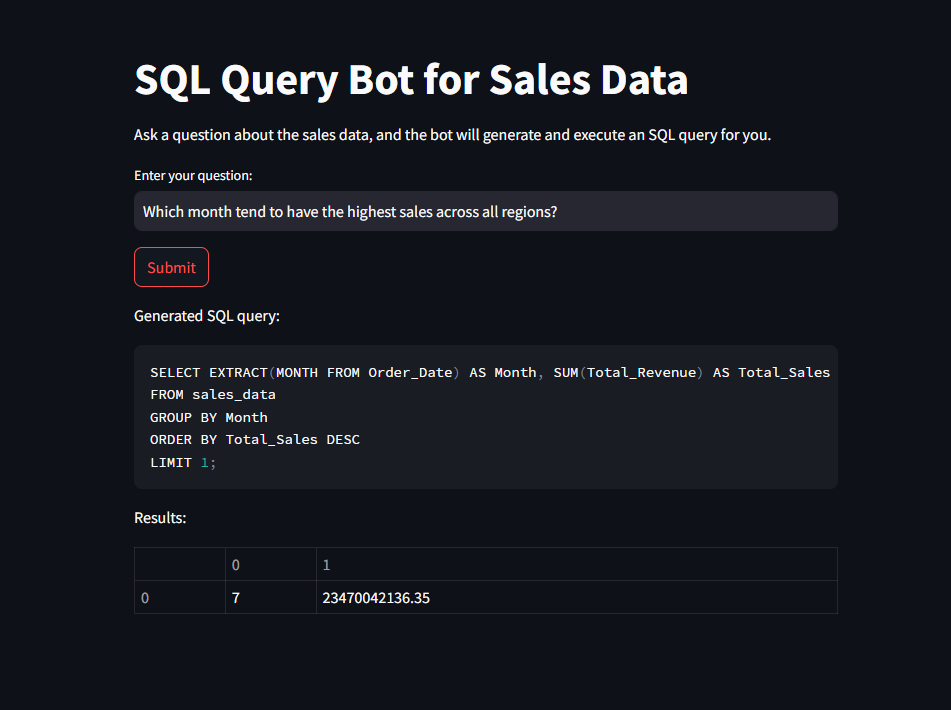
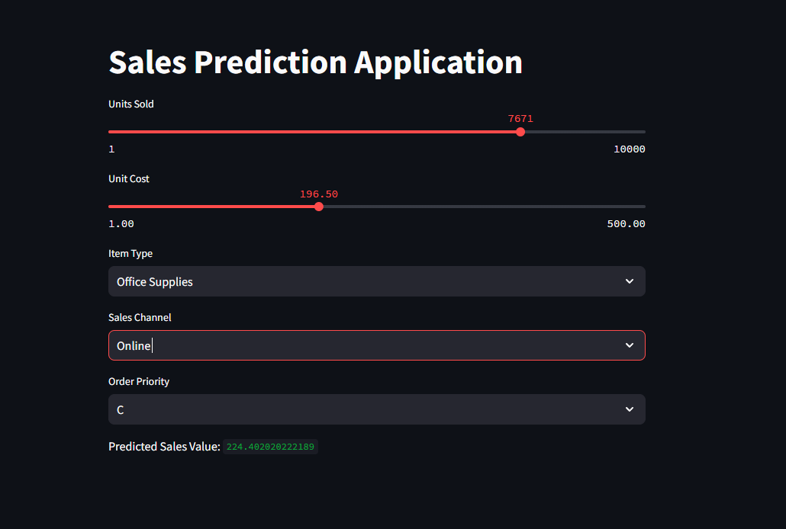

# SHAI-Project

This repository contains code and resources for a sales analysis and prediction project. The project includes:
- Exploratory Data Analysis (EDA)
- Model Development and Evaluation
- A SQL Query Bot for answering questions about sales data

## Features

1. **Data Analysis and Visualization**
   - Detailed exploratory data analysis on sales data.
   
2. **Sales Prediction Model**
   - A linear regression model to predict future sales volumes.
   
3. **SQL Query Bot**
   - A chatbot that translates user questions into SQL queries to retrieve sales data insights.

---

## Project Structure

- **Data_Analysis**: Jupyter notebooks for EDA.
- **Model_development**: Notebooks for model training and evaluation.
- **Sales_Model**: Model code and files.
- **SQLbot**: Code for the SQL chatbot.

---

## SQL Query Bot Demo



The SQL Query Bot can answer questions such as "Which countries generate the highest sales volumes?" by generating and executing SQL queries based on user input.

---

## Sales Prediction Model



This model predicts sales based on historical data using linear regression. The model is trained and evaluated to ensure accuracy.

---

## Getting Started

1. **Clone the repository**:
   ```bash
   git clone https://github.com/emran771/SHAI-Project.git
